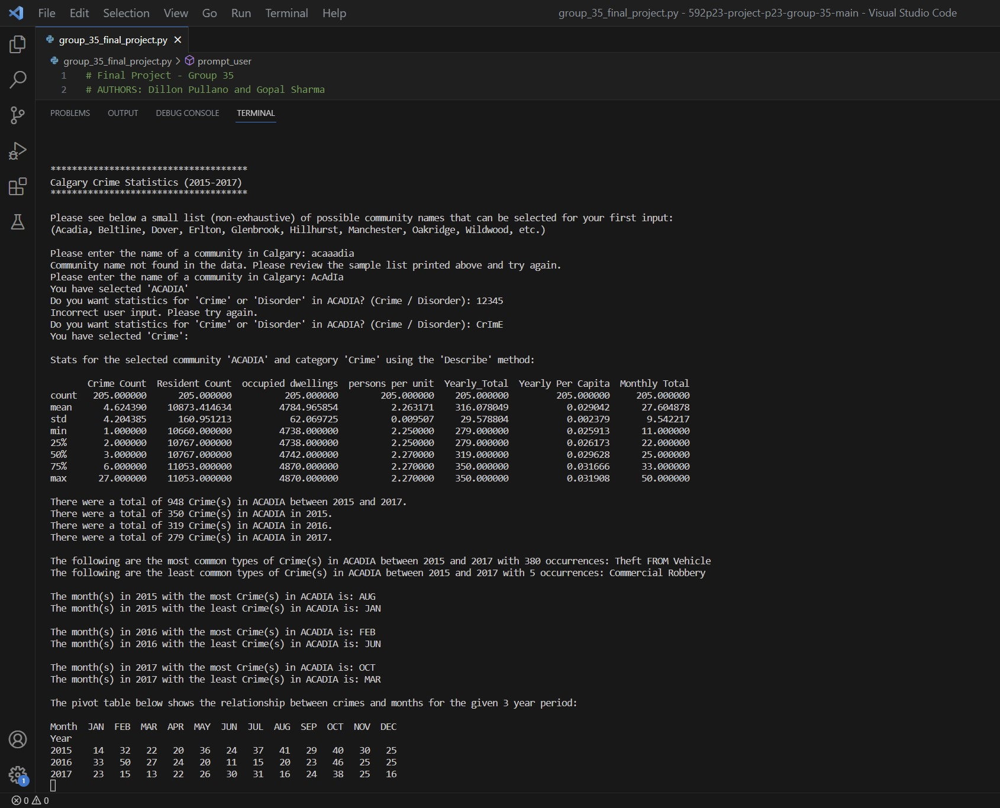
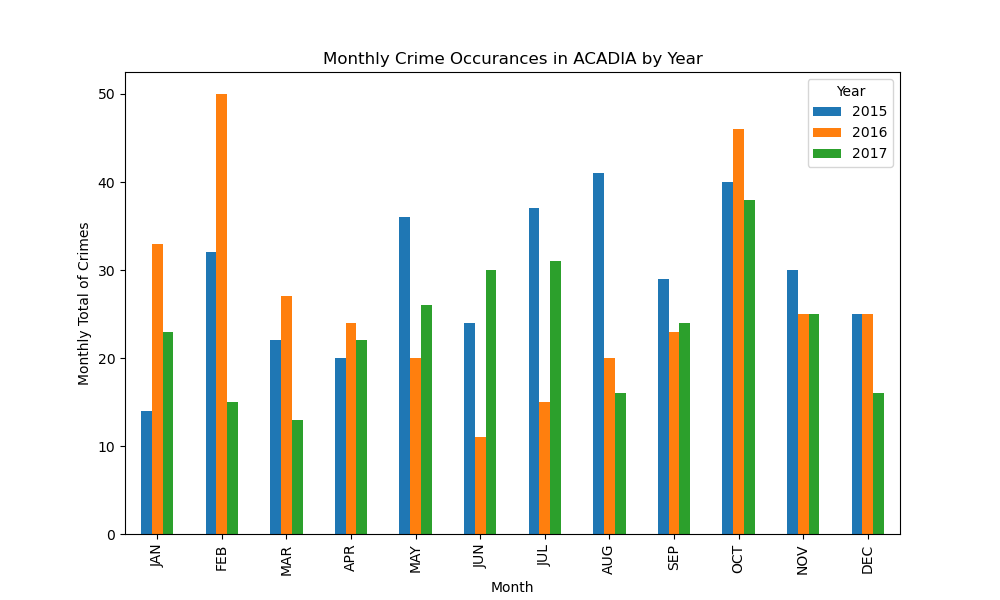

# Calgary Crime and Disorder Data Analysis

## Project Overview

Author : Gopal Sharma

This terminal-based data analysis application analyzes crime and disorder statistics for user-specified communities in Calgary, Alberta, between 2015 and 2017. It provides aggregated statistics based on the user's selection of a community and the type of analysis (crime or disorder). The application also generates a bar graph representing the total crimes per month over the 3-year period and exports indexed data to an Excel file for future reference.

## Dataset

The dataset used for this project consists of two different sources obtained from the Open Calgary Data Portal:

1. **Crime and Disorder Data:**

   - Community_Crime_and_Disorder_Statistics\_\_2015.xlsx
   - Community_Crime_and_Disorder_Statistics\_\_2016.xlsx
   - Community_Crime_and_Disorder_Statistics\_\_2017.xlsx

2. **Historical Community Populations:**
   - Historical_Community_Populations_1968-2017.xlsx

The final combined dataset has ten columns and 36,923 rows.

## Project Stages

### Stage 1: Dataset Selection

- Utilized four separate Excel sheets related to crime, disorder, and community populations.

### Stage 2: Data Frame Creation

- Conducted various operations on Pandas Data Frame, including merging, deletion of duplicated columns/rows, creation of hierarchical indexes, sorting data, and checking for Null values.
- Avoided the use of global variables.

### Stage 3: User Entry

- Created an interface for users to input the community name and category of crime.
- Implemented try/except statements to handle errors and prompt for user input.

### Stage 4: Analysis and Calculations

- Added three additional columns to the merged data frame: Yearly Total (Crimes), Monthly Total (Crimes), and Yearly Per Capita (Crimes).
- Presented data trends using the Describe method and aggregation computations.
- Utilized masking operations, Groupby operations, and created a Pivot table.
- Developed user-defined functions.

### Stage 5: Export and Matplotlib

- Exported the entire merged, hierarchical dataset to an Excel file (Selected_Community_Data_Output.xlsx) in the working directory, including the index and header values.
- Used Matplotlib to create a plot, saving it as a .PNG file (my_figure.png).

## Execution Screenshot

## Function Descriptions

1. **`load_data()`**

   - Loads crime and disorder statistics for 2015, 2016, and 2017.
   - Merges crime and historical data.

2. **`prompt_user(df_2015_2017)`**

   - Asks the user for input variables (community name and category of crime/disorder).
   - Implements error handling for user input.

3. **`slice_user_data(df_stat_merged, user_input1, user_input2)`**

   - Slices out a subset of data based on user inputs (community name and category).

4. **`add_yearly_total_columns(df_comm_cat)`**

   - Adds a column reflecting the yearly total crime.
   - Returns a new DataFrame with the added column.

5. **`add_monthly_total_columns(df_comm_cat_2)`**

   - Adds a column reflecting the monthly total crime.
   - Returns a new DataFrame with the added column.

6. **`occurrence_max_min(df_comm_cat_4, user_input1, user_input2)`**

   - Calculates and outputs the most and least common category of crime/disorder in the community.

7. **`month_max_min(df_comm_cat_3, year, user_input1, user_input2)`**

   - Finds and outputs the months with the maximum and minimum crimes for a specified year.

8. **`main()`**
   - Main entry point implementing different components of the application.

## Constants

- Constants for file names have been defined for better maintainability.
