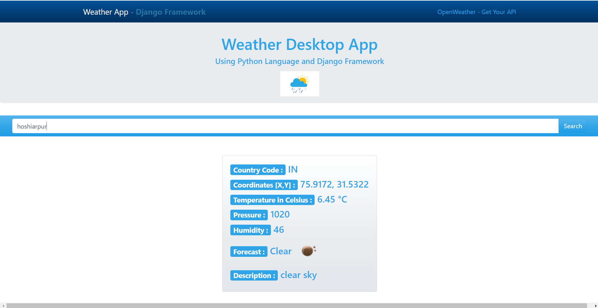

# Weather Project

Welcome to the Weather Project! This Django project provides weather information through a web application. You can enter a city name and get the country code, coordinates, current temperature,Pressure, humidity,Forecast, and weather description for that location.

## Project Structure

The project is organized as follows:

- **`manage.py`**: Django management script.
- **`db.sqlite3`**: SQLite database file.
- **`weatherProject`**: Django project folder.

  - **`wsgi.py`**: WSGI configuration for production.
  - **`urls.py`**: Main URL configuration.
  - **`settings.py`**: Project settings.
  - **`asgi.py`**: ASGI configuration for production.
  - **`__init__.py`**: Python package initialization.
  - **`__pycache__`**: Cached Python files.

- **`weatherApp`**: Django app for weather information.
  - **`views.py`**: Views for the app.
  - **`urls.py`**: URL configuration for the app.
  - **`tests.py`**: Tests for the app.
  - **`models.py`**: Database models for the app.
  - **`apps.py`**: App configuration.
  - **`admin.py`**: Admin configuration.
  - **`__init__.py`**: Python package initialization.
  - **`templates`**: Folder for HTML templates.
  - **`static`**: Folder for static files.
  - **`migrations`**: Database migrations.
  - **`__pycache__`**: Cached Python files.

## Environment Setup

Follow these steps to set up the environment for the Weather Project:

1. **Clone the Repository:**

   ```bash
   git clone https://github.com/keveonn-cool/Projects-Showcase.git

   Navigate to the Weather Project Directory:
   ```

2. **Navigate to the Weather Project Directory:**

cd Projects-Showcase/Django-Projects/django1/weatherProject

3. **Create and Activate the Virtual Environment: On Windows:**

   ```
   python -m venv env_site
   .\env_site\Scripts\activate
   ```

On Unix or MacOS:
`python3 -m venv env_site
    source env_site/bin/activate`

After activation, your command prompt or terminal prompt should indicate the active virtual environment.

4. **_Install Dependencies:_**

   ` pip install -r requirements.txt`

5. **_Apply Migrations:_**

   ```
   python manage.py migrate
   ```

6. **_Run the Development Server:_**

   ```
   python manage.py runserver
   ```

   The development server will be accessible at http://127.0.0.1:8000/.

7. **_Access the Weather App:_**

Open your web browser and go to http://127.0.0.1:8000/weatherApp/ to explore the Weather App.

### Project output Screenshot



# Additional Information

- Feel free to customize the project settings, add more features to the app, and enhance the project according to your requirements.
- For production deployment, refer to Django’s documentation on deploying web applications.
- Enjoy exploring the Weather Project!

  ```

  I hope this helps you with your project. If you have any feedback or suggestions, please let me know. Have a great day! 😊
  ```
